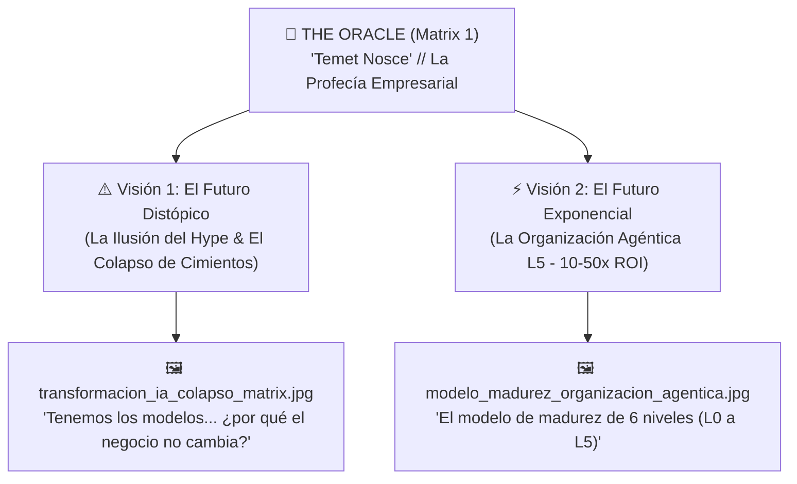

# 🔮 The Oracle (Matrix 1) - Las Visiones del Futuro de la IA en GeekSoft

> **Blueprint de Diseño y Arquitectura UI/UX para Web.Geeksoft**  
> **Fecha:** 30 de Septiembre, 2026  
> **Autor / Estrategia:** GeekSoft AI Engineering  
> **Estado:** Listo para Implementación

---

## 🎯 1. La Visión Conceptual del Personaje

En la narrativa de GeekSoft inspirada en **The Matrix**:
- **Morpheus** te despierta y te ofrece la elección binaria (*Red Pill vs Blue Pill*).
- **Neo & Trinity** representan a los clientes y empresas que rompieron sus cadenas construyendo soluciones reales (**DELFOS, DEFACTO, PROPTWIN**).
- **V (V de Vendetta / Vibe Coding)** entrega el manifiesto y la filosofía de la ingeniería quirúrgica.

### ¿Cuál es el rol de **The Oracle (El Oráculo)**?
**El Oráculo no te ofrece pastillas.** El Oráculo no te dice qué hacer; **te muestra el futuro** y te hace la pregunta definitiva:  
> *"Temet Nosce (Conócete a ti mismo): ¿En qué futuro va a terminar tu empresa?"*

El Oráculo revela los dos futuros posibles para cualquier directivo u organización que decide adoptar Inteligencia Artificial en 2026:

---

## 🖼️ 2. Las Dos Infografías Clave Integradas

| Visión del Oráculo | Infografía Asociada | Mensaje Profético para el Cliente |
| :--- | :--- | :--- |
| **1. El Colapso por Falta de Cimientos** | `transformacion_ia_colapso_matrix.jpg` | *"Si compras licencias de modelos sin construir datos limpios, procesos y arquitectura SaaS a medida, tu puente se partirá en el aire y tu equipo colapsará."* |
| **2. La Organización Agéntica L5** | `modelo_madurez_organizacion_agentica.jpg` | *"Si cruzas el Umbral Crítico y pasas de la asistencia pasiva a la ejecución con cuadrillas agénticas gobernadas, tu impacto de negocio se multiplicará por 10x - 50x."* |

---

## 🎨 3. Arquitectura UI / UX y Plan de Implementación en `Web.Geeksoft`

### A. Avatar y Estilo Visual del Oráculo
- **Estética:** Retrato estilizado en cyber-noir / Matrix de *The Oracle* (Gloria Foster) en su cocina iluminada por luz verde digital, sosteniendo una taza o galleta con código Matrix fluyendo sutilmente de fondo.
- **Ubicación del Archivo:** `C:\Users\rguti\Web.Geeksoft\public\images\oracle_head.jpg`.

### B. Opciones de Integración en la Web:

#### 🔹 Opción 1 (Recomendada): Modal Profético Interactivo (*The Oracle Chamber*)
- Un botón o avatar flotante de **THE ORACLE** en la Home con la leyenda *"Conoce tu Futuro (Temet Nosce)"*.
- Al hacer clic, se despliega una experiencia interactiva a pantalla completa con selector tipo toggle:  
  `[ ⚠️ EL DESTINO FALLIDO ]` $\longleftrightarrow$ `[ ⚡ EL DESTINO EXPONENCIAL ]`.
- Muestra las dos infografías con zoom nítido y llamada a la acción hacia WhatsApp.

#### 🔹 Opción 2: Nueva Ruta Dedicada `/oraculo` (o `/visiones`)
- Una experiencia completa con su propio shader y análisis interactivo de madurez.

---

## 🛠️ 4. Roadmap de Desarrollo por Fases

1. **Fase 1 (Generación de Asset de Avatar):**
   - Generar `oracle_head.jpg` en estilo Matrix 1 / GeekSoft y guardarlo en `public/images/`.
2. **Fase 2 (Componente React `OracleVisionModal.tsx`):**
   - Crear el componente modular con tabs para alternar entre la Visión Distópica y la Visión Utópica.
3. **Fase 3 (Conexión en `src/app/page.tsx`):**
   - Integrar el disparador del Oráculo en la Home sin alterar los shaders ni romper la estabilidad del Radar polar.
4. **Fase 4 (QC & Verificación):**
   - Probar compilación con `npm run build` en terminal.
