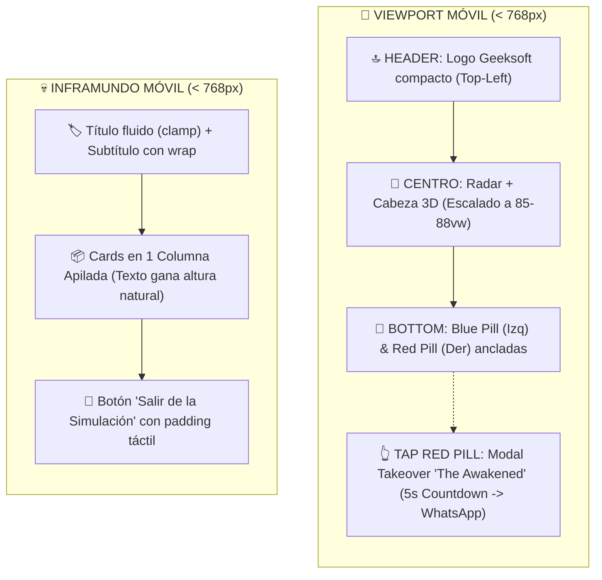

# 📱 Plan Maestro de Responsividad Móvil (Mobile Portrait)
## Protocolo Forense & Guía de Implementación Benoit Blanc (`BEN-LEG-CLON-DIFF-QC-NOTA`)

> *"Un gran detective jamás adivina cómo se verá la interfaz en un dispositivo real: escucha las pistas del testigo, establece los límites matemáticos del viewport, blinda cada componente con cirugía mínima y valida en terminal antes del veredicto final."*  
> — **Detective Benoit Blanc**

---

## 🧭 1. Declaración del Caso & Diagnóstico de Campo (BEN)

### 🎙️ Evidencia Testimonial (Transcripción Directa de `RESPONSIVIDAD.ogg`)
> *"Gemini, ahora vamos finalmente a trabajar en la responsividad de la página para que pueda verse en celulares, principalmente (portrait / celular parado):*
> 1. *El círculo interior (el radar) tiene que reducirse en su diámetro de manera que entre en un celular parado. Todo debe ajustarse hacia el centro de la cabeza de Geeksoft.*
> 2. *La Blue-Pill y Red-Pill deberían acercarse y ubicarse debajo del círculo en la esquina inferior izquierda y derecha.*
> 3. *El logo Geeksoft debería ajustar su tamaño y ubicarse arriba del círculo alineado hacia la mano izquierda.*
> 4. *En la página de los villanos (`/inframundo`): el texto de las cards se comprime ganando altura, de manera que las 4 cards encajen y se lean perfecto. El título 'Sigue durmiendo en el caos' debe encajar al ancho de la pantalla y el botón 'Salir de la simulación' ubicarse abajo.*
> 5. *The Awakened (Héroes) en celular: Como en celular no hay hover de mouse, al tocar la Red Pill debe desplegarse un modal/takeover que ocupe toda la pantalla mostrando a The Awakened durante unos 5 segundos antes de redirigir al WhatsApp."*

### 🛠️ Tácticas Comprobadas Heredadas de `Tienda.APPLE.PS5`
1. **Centrado Matemático y Dimensionamiento por Viewport:**
   - En móviles: `w-[88vw]`, `max-w-[360px]` y contención estricta en el eje Y (`max-h-[70vh]`) para evitar desbordes con barras del navegador móvil.
2. **Navegación Flotante Concéntrica (Doble Comportamiento Mobile vs. Desktop):**
   - Móvil: Anclajes táctiles absolutos en las esquinas inferiores con `touch target` de 44px+ (`bottom: 1.5rem`).
   - Desktop: Posicionamiento amplio en las esquinas del viewport (`bottom: 2.5rem; left/right: 2.5rem`).
3. **Transformación Dual de Grid:**
   - Desktop: Grid 2x2 espacioso de 1360px.
   - Mobile: Reestructuración fluida a 1 columna apilada donde el texto gana altura natural sin scroll horizontal.
4. **Optimización Vectorial y Cero Overflows:**
   - Eliminación de desbordes horizontales mediante `overflow-x: hidden`, tipografía con `clamp()` y SVGs dinámicos escalables.

---

## 🔎 2. La Escena del Crimen Actual (LEG)

### A. Página Principal / Radar ([`src/app/page.tsx`](file:///c:/Users/rguti/Web.Geeksoft/src/app/page.tsx))
* **Radar 3D / Contenedor Central:** El radar está diseñado actualmente con dimensiones fijas (`520px - 580px`), lo que desborda en pantallas de `360px - 414px` de ancho típicas de smartphones.
* **Panel de Píldoras:**
  - `Blue Pill`: Fijada en `left: 2.5rem; bottom: 2.5rem`. En pantallas angostas queda desconectada del foco visual.
  - `Red Pill`: Depende del hover CSS (`.red-pill-wrapper:hover .awakened-popover`), el cual es inaccesible en pantallas táctiles.
* **Logo Header:** Ubicado con tamaños estáticos que necesitan escalado adaptativo en resoluciones compactas.

### B. Página del Inframundo ([`src/app/inframundo/page.tsx`](file:///c:/Users/rguti/Web.Geeksoft/src/app/inframundo/page.tsx))
* **Grid 2x2:** Diseñado con `gridTemplateColumns: repeat(2, minmax(0, 1fr))` y `maxWidth: 1360px`. En móviles fuerza a 2 columnas extremadamente comprimidas que rompen la legibilidad del copy.
* **Encabezado:** El subtítulo cuenta con `whiteSpace: nowrap`, generando desborde horizontal en viewports móviles menores a 768px.

---

## 🛡️ 3. Respaldo y Puntos de Seguridad (CLON)

Antes de cualquier cirugía en los archivos productivos, se asegurarán los safe points canónicos:
* `src/app/page_legacy.tsx`
* `src/app/inframundo/page_legacy.tsx`
* `src/app/globals_legacy.css`
* Tag conmemorativo Git: `PRE.RESPONSIVIDAD.MOBILE`

---

## 📐 4. Cirugía Quirúrgica y Diferencias (DIFF)



### Plan de Cambios por Archivo:

### 1. `src/app/page.tsx` & `src/app/globals.css`
1. **Radar Responsive Container:**
   - Crear regla CSS / inline responsive: `@media (max-width: 768px)` con `width: min(88vw, 360px); height: min(88vw, 360px);`.
   - Ajustar los radios orbitales concéntricos y las posiciones de los orbes para que se recalculen proporcionalmente al radio base.
2. **Posición de Píldoras en Móvil:**
   - `blue-pill`: `bottom: 1.5rem; left: 1.2rem;`
   - `red-pill`: `bottom: 1.5rem; right: 1.2rem;`
3. **Modal Takeover "The Awakened" (Móvil):**
   - Estado React `const [showAwakenedModal, setShowAwakenedModal] = useState(false);`
   - `const [countdown, setCountdown] = useState(5);`
   - En pantallas móviles, al hacer tap en la píldora roja, se abre el takeover a pantalla completa con blur oscuro (`backdrop-filter: blur(25px)`), mostrando las tarjetas de **Morpheus, Neo y Trinity**, un temporizador visual de 5 segundos y el botón directo para hablar al WhatsApp oficial.

### 2. `src/app/inframundo/page.tsx`
1. **Grid Responsive:**
   - En desktop (`>= 768px`): `gridTemplateColumns: "repeat(2, minmax(0, 1fr))"`.
   - En mobile (`< 768px`): `gridTemplateColumns: "1fr"`, `gap: "1rem"`, `padding: "1rem 1.2rem"`.
2. **Cards con Altura Dinámica:**
   - `minHeight: "auto"`, permitiendo que el texto se expanda verticalmente de forma natural.
   - Avatares circulares y Lotties escalados proporcionalmente (`width: 72px; height: 72px;`).
3. **Encabezados Fluidos:**
   - Título: `fontSize: "clamp(1.4rem, 5.5vw, 2.4rem)"`.
   - Subtítulo: `whiteSpace: "normal"`, `maxWidth: "92vw"`.

---

## 🧪 5. Control de Calidad en Terminal (QC)

1. **Compilación Estricta Local:**
   ```bash
   npm run build
   # Debe resultar en exit code 0 con 0 errores de TypeScript y Turbopack.
   ```
2. **Matriz de Pruebas de Viewport (Auditoría Forense):**
   - **iPhone SE / Pantalla Angosta (375px x 667px):** Cero desborde horizontal (`overflow-x = 0`).
   - **iPhone 14/15 Pro (393px x 852px):** Radar centrado, píldoras perfectamente accesibles con el pulgar.
   - **Android Estándar (360px x 800px / 412px x 915px):** Lectura fluida de las 4 cards del Inframundo.
   - **Desktop (1920px x 1080px):** Verificación de **cero regresión** en la experiencia de escritorio.

---

## 📝 6. Dictamen Pericial & Despliegue (NOTA)

1. **Registro en Bitácoras:** Registrar en `interaction_log.txt` y `gemini_work_log.txt`.
2. **Despliegue a Producción:** Ejecutar `python scripts/deploy_geeksoft.py` y validar el estado activo en [https://geeksoft.tech](https://geeksoft.tech).
