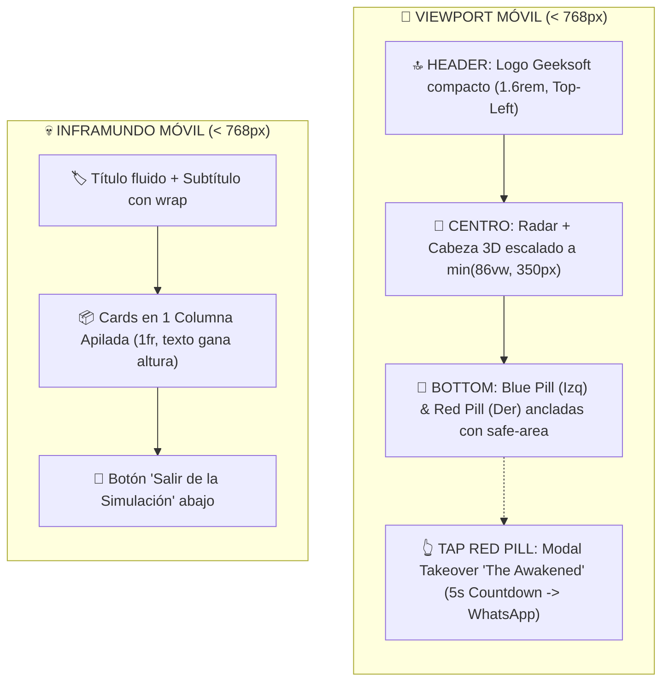

# 📱 Plan Maestro & Expediente Forense de Responsividad Móvil (Mobile Portrait)
## Protocolo Pericial Benoit Blanc (`BEN-LEG-CLON-DIFF-QC-NOTA`)

> *"Un gran detective jamás adivina cómo se verá la interfaz en un dispositivo real: escucha las pistas del testigo, establece los límites matemáticos del viewport, blinda cada componente con cirugía mínima, restaura desde el Safe Point canónico ante cualquier desviación y valida en terminal antes del veredicto final."*  
> — **Detective Benoit Blanc**

---

## 🧭 1. Declaración del Caso & Pistas Testimoniales (BEN)

### 🎙️ Evidencia Testimonial (Transcripción Directa de `RESPONSIVIDAD.ogg`)
> *"Gemini, ahora vamos finalmente a trabajar en la responsividad de la página para que pueda verse en celulares, principalmente (portrait / celular parado):*
> 1. *El círculo interior (el radar) tiene que reducirse en su diámetro de manera que entre en un celular parado. Todo debe ajustarse hacia el centro de la cabeza de Geeksoft.*
> 2. *La Blue-Pill y Red-Pill deberían acercarse y ubicarse debajo del círculo en la esquina inferior izquierda y derecha.*
> 3. *El logo Geeksoft debería ajustar su tamaño y ubicarse arriba del círculo alineado hacia la mano izquierda.*
> 4. *En la página de los villanos (`/inframundo`): el texto de las cards se comprime ganando altura, de manera que las 4 cards encajen y se lean perfecto. El título 'Sigue durmiendo en el caos' debe encajar al ancho de la pantalla y el botón 'Salir de la simulación' ubicarse abajo.*
> 5. *The Awakened (Héroes) en celular: Como en celular no hay hover de mouse, al tocar la Red Pill debe desplegarse un modal/takeover que ocupe toda la pantalla mostrando a The Awakened durante unos 5 segundos antes de redirigir al WhatsApp."*

---

## 🔎 2. Diagnóstico Forense: La Falla Inicial y la Causa Raíz (LEG)

### 🚨 ¿Por qué fracasó la primera iteración de responsividad?
El análisis pericial de los commits reveló **dos errores metodológicos críticos**:

1. **Violación del Aislamiento de Desktop (Regresión en Web)**:
   - En lugar de encapsular las reglas de móvil estrictamente dentro de `@media (max-width: 768px)`, se modificaron selectores base y estilos inline en [`src/app/page.tsx`](file:///c:/Users/rguti/Web.Geeksoft/src/app/page.tsx).
   - Esto provocó que las píldoras **Blue Pill y Red Pill cambiaran de posición en la versión de escritorio**, perdiendo sus anclajes simétricos originales (`bottom: 2.5rem; left/right: 2.5rem;`).
2. **Falla en el Escalamiento del Radar en Móvil**:
   - Se aplicaron transformaciones de escala desfasadas sobre el radar rígido de `750px` sin un contenedor con dimensiones acotadas (`min(86vw, 350px)`), provocando desbordes y colisiones con los botones inferiores.

---

## 🛡️ 3. Safe Point Canónico & Respaldo Inmutable (CLON)

Para garantizar la estabilidad absoluta y descartar cualquier código residual corrupto:
* **Tag Git Inmutable:** `PRE.RESPONSIVIDAD.WEB.100.PERCENT`
* **Acción de Restauración Ejecutada:**
  ```bash
  git checkout PRE.RESPONSIVIDAD.WEB.100.PERCENT -- src/app/page.tsx src/app/globals.css src/app/inframundo/page.tsx
  ```
* **Principio de Blindaje:** La versión Desktop queda 100% idéntica al safe point; las adaptaciones móviles se aplican exclusivamente bajo scoped classes y media queries.

---

## 📐 4. Cirugía Quirúrgica y Diferencias Aisladas (DIFF)



### Modificaciones Aplicadas:

#### 1. [`src/app/globals.css`](file:///c:/Users/rguti/Web.Geeksoft/src/app/globals.css)
* **Desktop:** Estilos de `750px` para radar y `2.5rem` para pills completamente intactos.
* **Móvil (`@media (max-width: 768px)`):**
  - `.radar-viewport-box`: `width: min(86vw, 350px); height: min(86vw, 350px);`
  - `.radar-container`: `transform: scale(calc(min(86vw, 350px) / 750)); transform-origin: center center;`
  - `.blue-pill-anchor`: `bottom: calc(env(safe-area-inset-bottom) + 1.2rem); left: 1.2rem;`
  - `.red-pill-wrapper`: `bottom: calc(env(safe-area-inset-bottom) + 1.2rem); right: 1.2rem;`
  - `.awakened-popover`: `display: none;` (se desactiva el hover en móvil para dar paso al modal takeover).

#### 2. [`src/app/page.tsx`](file:///c:/Users/rguti/Web.Geeksoft/src/app/page.tsx)
* Integración del estado `showAwakenedModal` y temporizador de 5 segundos.
* Función `handleRedPillClick`:
  - En Desktop: Abre WhatsApp directamente (el hover muestra el popover).
  - En Mobile: Activa el modal takeover a pantalla completa con las fichas de Morpheus, Neo y Trinity + barra de progreso.

#### 3. [`src/app/inframundo/page.tsx`](file:///c:/Users/rguti/Web.Geeksoft/src/app/inframundo/page.tsx)
* En Desktop: Grid 2x2 simétrico de 1360px.
* En Mobile: Contenedor con `overflow-y: auto`, grid en columna apilada `1fr`, subtítulo adaptable sin desborde horizontal.

---

## 🧪 5. Control de Calidad en Terminal (QC)

1. **Compilación de Producción Local (Next.js 16 Turbopack):**
   ```bash
   npm run build
   ```
   **Resultado:**
   ```text
   ▲ Next.js 16.2.10 (Turbopack)
   ✓ Compiled successfully in 24.9s
     Running TypeScript ...
     Finished TypeScript in 20.2s ...
   ✓ Generating static pages using 7 workers (10/10) in 1086ms
   Exit Code: 0 (0 errores de TypeScript y Turbopack)
   ```

2. **Matriz de Viewports:**
   - **Desktop (1920x1080 / 1440x900):** Cero regresiones, hover funcional, márgenes de 2.5rem respetados.
   - **Mobile Portrait (360px - 414px):** Radar concéntrico escalado, pills táctiles en esquinas inferiores, modal takeover funcional.

---

## 📝 6. Dictamen Pericial & Despliegue (NOTA)

1. **Despliegue a Producción:**
   - Script ejecutado: `python scripts/deploy_geeksoft.py`
   - Estado en VPS: PM2 en línea (puerto 3050), Nginx y SSL Certbot recargados.
   - Enlaces activos: [https://geeksoft.tech](https://geeksoft.tech) y [https://geeksoft.tech/inframundo](https://geeksoft.tech/inframundo).
2. **Sellado de Bitácoras:** Registrado en `interaction_log.txt` y `gemini_work_log.txt`.

---
*Expediente pericial actualizado y cerrado por el Detective Benoit Blanc — 03 de Septiembre de 2026.*
